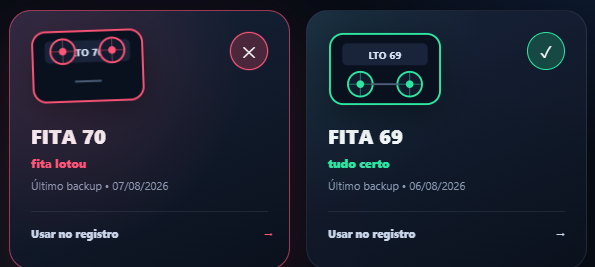
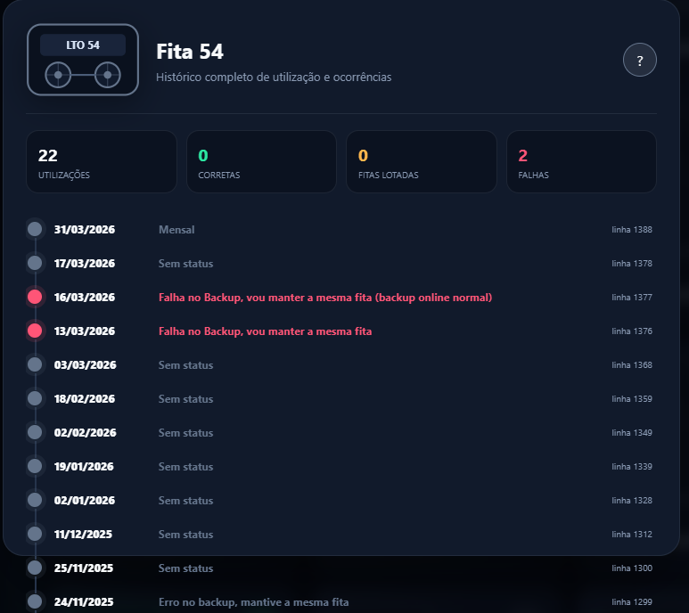

# LTO Vault

Uma interface desktop moderna para registrar e consultar backups em fitas LTO usando uma planilha Excel como base de dados.

O LTO Vault foi pensado para equipes que já possuem uma planilha de controle e querem uma operação diária mais rápida, visual e segura — sem migrar os dados para a nuvem ou criar cópias automáticas do arquivo.


## Interface

### Biblioteca de fitas

As fitas aparecem em ordem numérica decrescente, com o resultado mais recente, indicadores visuais e animações de interação.



### Histórico individual

Ao abrir uma fita, o aplicativo apresenta todas as utilizações encontradas, datas, resultados e um resumo das ocorrências.



## Principais recursos

- Atualização do registro diário com poucos cliques
- Escolha livre da fita, sem depender de ordem sequencial
- Cadastro de novas fitas
- Navegação por data
- Biblioteca animada com o último estado de cada fita
- Histórico completo por fita
- Mapeamento configurável da aba e das colunas da planilha
- Preservação da formatação existente ao salvar
- Sobrescrita somente das células de fita e status da linha escolhida
- Funcionamento local, sem telemetria e sem envio de dados

## Como usar

1. Abra o LTO Vault.
2. Clique na engrenagem e configure o mapeamento da planilha.
3. Clique em **Selecionar planilha** e escolha o arquivo `.xlsx` ou `.xlsm`.
4. Selecione a data e a fita desejadas.
5. Escolha **Tudo certo**, **Fita lotou** ou **Informar falha**.
6. Confirme a alteração.

O aplicativo salva diretamente no arquivo selecionado. Feche a planilha no Excel antes de alterar um registro, pois o Excel pode bloquear a gravação enquanto o arquivo estiver aberto.

## Formato esperado da planilha

O mapeamento padrão usa uma aba chamada `Daily` e as seguintes colunas:

| Coluna | Conteúdo |
|:---:|---|
| A | Identificador da fita |
| B | Data do backup |
| E | Status ou observação |

Você pode trocar o nome da aba e as letras das colunas pela engrenagem do aplicativo. As datas devem ser datas reais do Excel ou textos reconhecíveis, como `2026-08-24` e `24/08/2026`.

Para gerar uma planilha fictícia de teste:

```powershell
python .\examples\create_sample_workbook.py
```

## Executar pelo código-fonte

Requisitos: Windows 10/11, Python 3.11 ou mais recente e Microsoft Edge WebView2 Runtime.

```powershell
git clone https://github.com/SEU-USUARIO/lto-vault.git
cd lto-vault
powershell -ExecutionPolicy Bypass -File .\run.ps1
```

Na primeira execução, o script cria o ambiente virtual e instala as dependências automaticamente.

## Gerar um executável

```powershell
powershell -ExecutionPolicy Bypass -File .\build.ps1
```

O arquivo final será criado em `dist\LTO Vault.exe`. O usuário do executável não precisa instalar Python; o WebView2 normalmente já acompanha as versões atuais do Windows 10 e 11.

## Privacidade e segurança

- A planilha nunca é enviada para serviços externos.
- O caminho do último arquivo e as fitas cadastradas ficam no diretório de dados do usuário.
- Planilhas, configurações locais, logs e artefatos de build são ignorados pelo Git.
- O projeto não cria backups automáticos da planilha.

Recomenda-se testar primeiro com uma cópia do arquivo e manter o backup corporativo habitual. Consulte também [SECURITY.md](SECURITY.md).

## Estrutura do projeto

```text
lto-vault/
├── src/
│   ├── app.py              # leitura, gravação e integração com o Excel
│   └── index.html          # interface, estilos e animações
├── examples/
│   └── create_sample_workbook.py
├── build.ps1               # gera o executável
├── run.ps1                 # prepara e executa o ambiente
└── requirements.txt
```

## Licença

Este repositório ainda não possui uma licença de código aberto. O código pode ser consultado publicamente, mas a reutilização, modificação e redistribuição não são concedidas até que uma licença seja adicionada.
