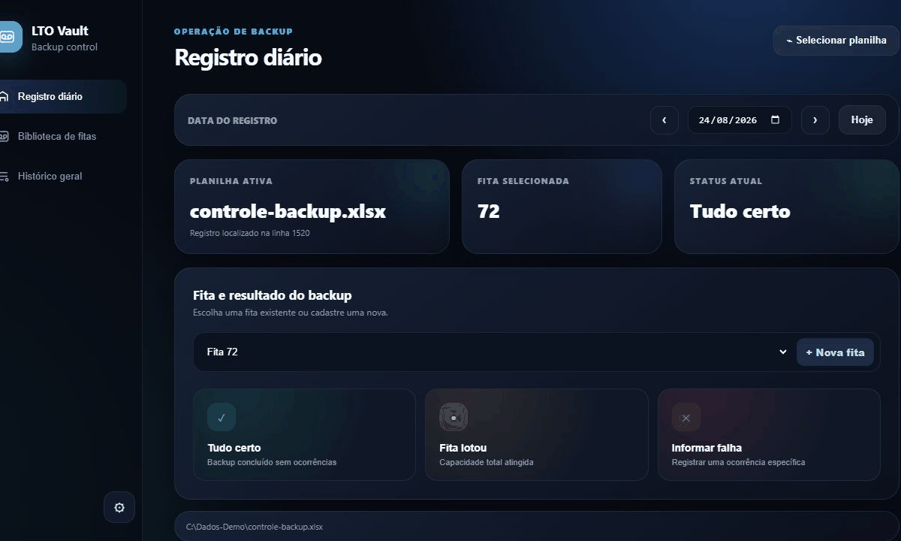
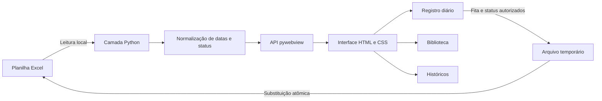
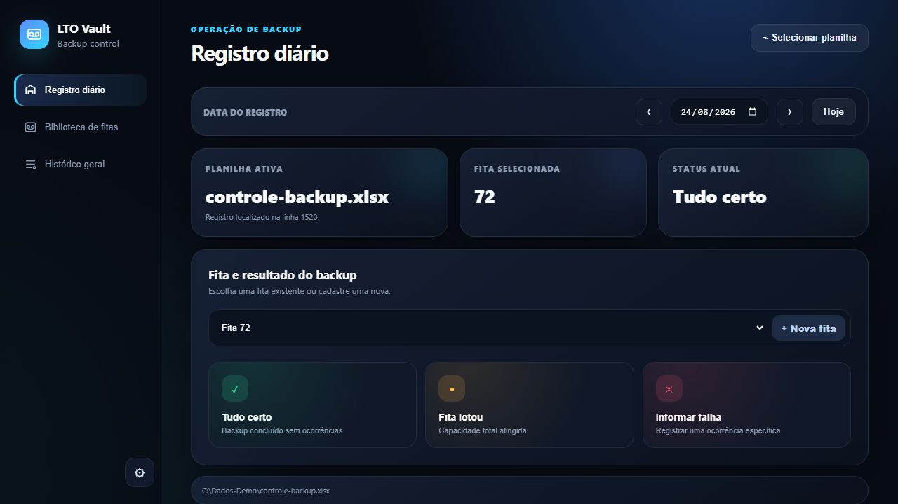
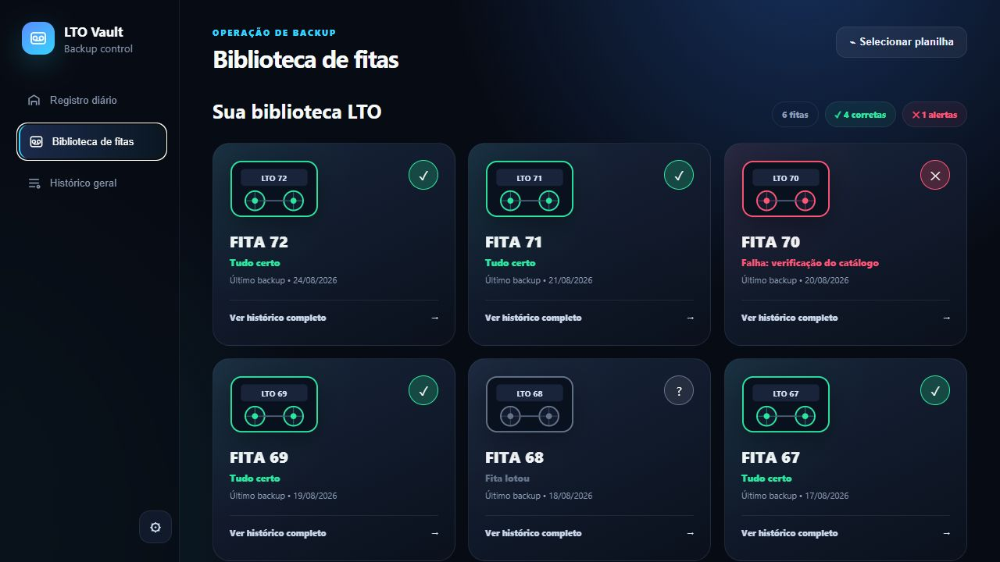
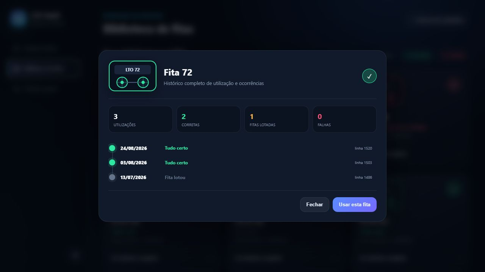
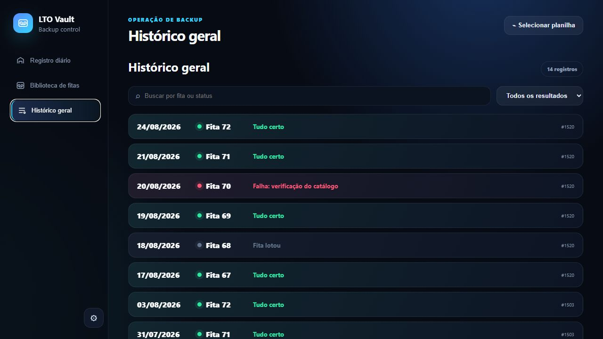

# LTO Vault

> Aplicação desktop para registrar, consultar e auditar backups em fitas LTO usando uma planilha Excel como fonte de dados.


O LTO Vault transforma uma planilha de controle em uma experiência operacional rápida, visual e segura, sem enviar dados à nuvem ou exigir a migração do processo existente.

> A demonstração usa a interface real do projeto com uma planilha totalmente sintética. Identificadores, datas, caminhos e ocorrências foram criados exclusivamente para o portfólio.



## Navegação

- [Visão geral](#visão-geral)
- [O desafio](#o-desafio)
- [A solução](#a-solução)
- [Arquitetura](#arquitetura)
- [Decisões de engenharia](#decisões-de-engenharia)
- [Interface](#interface)
- [Executar o projeto](#executar-o-projeto)
- [Privacidade e segurança](#privacidade-e-segurança)

## Visão geral

Equipes que administram backups em mídia física frequentemente dependem de planilhas extensas para identificar a fita utilizada, registrar o resultado diário e investigar ocorrências anteriores. O LTO Vault preserva esse arquivo como fonte oficial e adiciona uma camada desktop dedicada à rotina: registro diário, biblioteca visual, histórico individual e pesquisa global.

### Minha atuação

- Levantamento do fluxo operacional e das regras de negócio.
- Desenvolvimento da aplicação desktop e da interface.
- Integração de leitura e escrita com arquivos Excel.
- Implementação das regras de normalização e categorização.
- Preservação de macros, links e estilos existentes.
- Empacotamento para Windows e documentação de uso.
- Criação de ambiente e dados sintéticos para demonstração pública.

## O desafio

A solução precisava melhorar a experiência diária sem comprometer o arquivo já adotado pela operação:

- manter os dados integralmente locais;
- funcionar com planilhas `.xlsx` e `.xlsm`;
- permitir o uso de qualquer fita disponível;
- preservar formatação, macros e links existentes;
- alterar apenas as células autorizadas;
- destacar fitas lotadas e falhas;
- oferecer rastreabilidade sem relatórios manuais;
- ser distribuída para Windows sem exigir Python do usuário final.

## A solução

A aplicação reúne quatro fluxos principais:

1. **Registro diário:** seleção de data, fita e resultado.
2. **Biblioteca de fitas:** visão consolidada do último estado de cada mídia.
3. **Histórico individual:** utilizações, sucessos, lotações e falhas.
4. **Histórico geral:** sequência pesquisável e filtrável de todos os registros.

### Principais recursos

- Atualização do registro diário em poucos cliques.
- Escolha livre e cadastro de fitas.
- Navegação por data.
- Biblioteca visual com o último estado de cada mídia.
- Histórico completo por fita.
- Histórico geral com busca e filtros.
- Mapeamento configurável de aba e colunas.
- Preservação da formatação existente.
- Operação local, sem telemetria ou envio de dados.

## Arquitetura



| Camada | Responsabilidade |
| --- | --- |
| Excel | Fonte operacional e histórico persistente |
| Python | Validação, leitura, escrita e regras de domínio |
| pywebview | Ponte entre o backend local e a interface |
| HTML/CSS/JavaScript | Experiência visual, navegação e feedback |
| PyInstaller | Distribuição em executável para Windows |

## Decisões de engenharia

### Atualizar somente os campos autorizados

A aplicação identifica exatamente a linha da data selecionada e modifica apenas a fita e o status. As demais células permanecem intocadas.

```python
sheet.cell(row, tape_column).value = tape
sheet.cell(row, status_column).value = status
```

### Salvar de forma segura

O workbook é gravado primeiro em um arquivo temporário no mesmo diretório. Somente após a gravação bem-sucedida ele substitui o arquivo original, reduzindo o risco de deixar uma planilha parcialmente escrita.

```python
workbook.save(temp_path)
os.replace(temp_path, workbook_path)
```

### Preservar o documento existente

Arquivos com macro são abertos com `keep_vba`, links são mantidos e o estilo visual das células é copiado de registros equivalentes.

### Normalizar entradas heterogêneas

Datas podem chegar como objetos do Excel, números seriais ou textos em formatos distintos. Status equivalentes são categorizados para que a interface apresente sucessos e alertas de maneira consistente.

```python
for pattern in ("%d/%m/%Y", "%d/%m/%y", "%Y-%m-%d"):
    parsed = datetime.strptime(value, pattern)
```

### Manter a operação offline

Não existe backend remoto. Interface, regras e arquivos permanecem no computador do usuário; o caminho da última planilha é salvo apenas na área de dados local do aplicativo.

## Interface

### Registro diário



A tela concentra data, planilha ativa, fita selecionada e resultado. A hierarquia visual reduz as decisões necessárias em uma tarefa recorrente.

### Biblioteca de fitas



Cada cartão apresenta o último resultado e a última utilização. Cores e ícones distinguem mídias disponíveis, lotadas ou com falhas.

### Histórico individual



O painel resume utilizações, sucessos, lotações e falhas antes de listar cada ocorrência.

### Histórico geral



A visão consolidada permite pesquisar por fita ou status e filtrar os resultados.

Quando a data selecionada ainda não existe, o aplicativo adiciona uma nova linha ao final da planilha, copia a formatação da linha anterior e preenche data, fita e status automaticamente.

## Formato esperado da planilha

O mapeamento padrão usa uma aba chamada `Daily`:

| Coluna | Conteúdo |
|:---:|---|
| A | Identificador da fita |
| B | Data do backup |
| E | Status ou observação |

O nome da aba e as letras das colunas podem ser alterados nas configurações. Para gerar uma planilha fictícia:

```powershell
python .\examples\create_sample_workbook.py
```

## Executar o projeto

Requisitos: Windows 10/11, Python 3.11+ e Microsoft Edge WebView2 Runtime.

```powershell
git clone https://github.com/LucaxOP/lto-vault.git
cd lto-vault
powershell -ExecutionPolicy Bypass -File .\run.ps1
```

### Gerar o executável

```powershell
powershell -ExecutionPolicy Bypass -File .\build.ps1
```

O resultado será criado em `dist\LTO Vault.exe`. O usuário final não precisa instalar Python.

## Tecnologias

- Python 3.11+
- pywebview
- openpyxl
- HTML, CSS e JavaScript
- PyInstaller
- Microsoft Edge WebView2

## Privacidade e segurança

- A planilha nunca é enviada para serviços externos.
- Não há telemetria ou backend remoto.
- O aplicativo escreve somente nas colunas configuradas de fita e status.
- Planilhas, configurações locais, logs e builds são ignorados pelo Git.
- A demonstração pública usa apenas uma planilha sintética.
- Nenhum caminho de rede, nome empresarial ou dado operacional real aparece nas mídias.
- Recomenda-se testar inicialmente com uma cópia e manter o processo habitual de backup.

Consulte também [SECURITY.md](SECURITY.md).

## Estrutura do projeto

```text
lto-vault/
├── src/
│   ├── app.py
│   └── index.html
├── examples/
│   └── create_sample_workbook.py
├── docs/images/
├── build.ps1
├── run.ps1
└── requirements.txt
```

## Licença

Este repositório ainda não possui licença de código aberto. O código pode ser consultado publicamente, mas reutilização, modificação e redistribuição não são concedidas até que uma licença seja adicionada.

---

Desenvolvido e documentado por **Lucas Paiva**.

